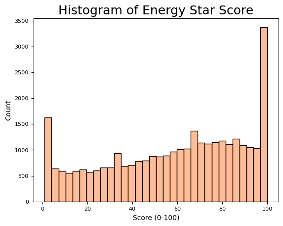
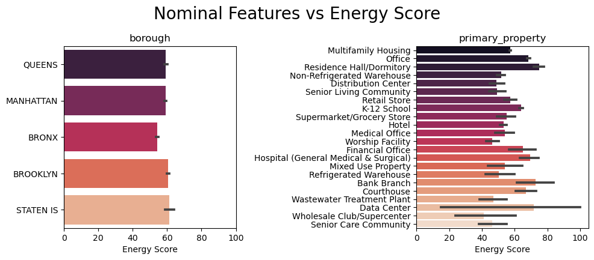

# Capstone Project - Measuring Energy Efficiency in NYC Buildings

## Introduction and Background

The ENERGY STAR score is a national standard for building energy efficiency.  It's noticeable across the country - a big sticker with a letter grade, accompanied by a numerical score from 0 to 100.  The energy star score rates a building on how energy efficient it is compared to national benchmarks for the same type of building.  

The score is calculated by a tool called the Portfolio Manager.  Building managers can input data about their annual electricity and water bills, their size, property use-types, and location.  The [technical report](https://portfoliomanager.energystar.gov/pdf/reference/ENERGY%20STAR%20Score.pdf) for the portfolio manager describes what data is collected and that it uses a regression to then calculate the score, on a 0-100 scale.  Past this, the model is a bit of a black box.  

Part of how the energy score is calculated is to compare the [site energy vs the source energy](https://www.energystar.gov/buildings/benchmark/understand_metrics/source_site_difference).  Site energy is what is consumed at the building itself - this would be equivalent to what's on the energy bill in terms of kWH.  Source energy is how much energy is being delivered to the building's power system - which could be from an offsite power plant, an onsite generator, or some calculated form of renewables.  This is considered a more equitable measurement since most buildings are just getting their power from a grid and cannot control transmission efficiency.  The portfolio manager uses a ratio of site and source energy in the calculation.  

## Problem Statement

This idea of an equitable grade led me to my question - what are the limitations of the portfolio manager score and are there other ways to create an energy efficiency model and change how we score building sustainability.  So my MVP would be to use the same building data and first create my own regression to calculate the energy score.  After that, my goal would be to improve the model in some way or add additional features to change how it's calculated.

## Data Description

I found the original dataset on [Kaggle](https://www.kaggle.com/datasets/mikhailma/energy-efficiency-of-buildings-in-new-york) annd cleaned it and fed it into my model.  After being a bit unhappy with the results, I looked for additional data and found a much better selection of datasets from New York City's [Open Data Site](https://data.cityofnewyork.us/browse?q=energy%20and%20water%20disclosure&sortBy=relevance).  I downloaded the data from the last 7 years, but only ended up using four of the files in my dataset (each dataset contained many duplicates since it's the annual report for NYC buildings - removing duplicates after merging the data showed that there were a few thousand unique buildings in each dataset).  I combined enough data until I had over 40,000 entries, each of which represents an individual building or campus of buildings.  The ENERGY STAR Score is given as a score 0-100 based on how much energy a building consumes against national benchmarks, which are also identified in each dataset.  

The dataset contained over 300 features, although many of these were different calculations of the same value or similar values.  Some of the data was what the building managers would provide, like the info in the utility bill, data from smart meters, and building occupancy/use info.  Other features in the dataset were the results of the energy portfolio calculations like total greenhouse gas emissions and consumption of specific fuel sources.

The New York City site also had a downloadable [Data_Dictionary](./data/Data_Dictionary) which is saved in the repo.  The file `'Column Info-Table 1.csv'` contains each individual column name and a description of what it means.  I used this dictionary as I went through my cleaning process and dropping irrelevant data.

## Data Cleaning

I then proceeded with the cleaning and preprocessing of my data.  More than a 100 of the questions were follow-up questions depending on what was the primary-use type, so those columns were almost all over 50% null and could be dropped.  Looking back, it would have been beneficial to fit different models for each category of the property type, so those sub-features could be taken into account, but I would need quite a bit more data to flesh that out fully. I then used various transformers to perform the following steps:
* Simple imputation: fill nulls with median (numerical data) and mode (categorical data)
* One Hot encoding: create dummy columns for categorical data (`borough` and `primary_property_type`)
* Polynomial Feature interactions: interactions between all the numerical data
* Simple Scaler: scale everything between -1 to 1

I also tried various transformations of the target variable, including `log`, `exp`, and `Quantile` transformers.  However, my model results did not seem to improve with these.  This process was iterative - I would adjust the features and transformers, run my models and come back and tweak them again.  

## Exploratory Data Analysis

Above is the distribution of scores in my dataset (after dropping entries with null scores).  It does not follow a normal distribution.  Instead, there are spikes at both 0 and 100, which suggests that the regression model from the portfolio manager is rounding or truncating the data at the ends.  The distribution also shows a slightly higher median (at 58) than the national median (at 50).  It seems like it would be a good idea to try some target transformations when iterating through my models.

During my EDA, most of the data was quantitative measurements, but it was really interesting to see some of the insights on the nominal data.  The above left image shows the score distribution across the geographic `boroughs` of New York City.  The dataset also contained other location features like `city` (too many incorrect non-city entries though) and `nta` (neighborhood tabulation areas).  The scores across the boroughs are fairly uniform, but there is a slightly higher average score in Staten Island, which can be explained by the smaller quantity of Staten Island observations.  The above right image describes the scores across the `primary_property_use`.  This feature had 22 drop down choices, and a distribution showed that over 70% of the data was primarily multifamily housing (apartments/duplexes/etc).  The chart shows that the residence hall/dorms have the highest average score, maybe because heat/cooling are centrally controlled.  Interestingly data centers had a pretty high mean score as well but with the widest deviation.

## Modeling

For modeling, I mostly focused on Linear Regression and just spent time tuning the train-test split, the regularization parameters and the features themselves.  I still didn't get a model that I was very happy with by the end, but finally landed on one iteration that gave me results that I felt were at least predictive.  I was seeing lots of issues in earlier iterations where my test scores were actually significantly better than my train scores, but adding the polynomial features increased variance and I saw a normal overfitting model, which was at least easier to make sense of.  The unregularized model was obviously way overfit because it was fitting almost 700 features, but the ElasticNet model performed well for both train and test.  

At this point, when I made my predictions, I also saw that my results were way outside the bounds of the Energy Star Score, ranging from -300 to +200.  I tried to normalize my predictions between 0 and 100, which did reduce my residuals but doesn't make for a very successful model.  This is definitely an area I would want to spend more time on, trying to figure out how to either transform my original y or my model predictions so that my predictions follow the same distribution as the original data.

## Conclusions

In conclusion, this was definitely a learning experience, to work with real world data that was not designed for any predictions.  Even after trying to reduce my feature space, I still had too many enmeshed and correlated features because many of the features were data calculated by the Portfolio manager.  And one piece I was missing was the weather data used for normalizing the results.  The portfolio manager scores the data after normalizing for weather and environmental factors.  These normalized data points were in my feature space, but I did not have the same raw data that the portfolio manager uses to create their regression.  

## Next Steps

As I continue this project, I would want to work a bit more on transforming the target data.  I tried a couple methods, but either didn't implement them properly or wasn't using the most appropriate transformers.  I think this would help a lot, since the original regression model wouldn't be able to make a linear prediction between 0 and 100 either without some kind of transformation.  I would also consider changing my prediction goal.  Instead of trying to predict the energy score, it might be more interesting to use the energy consumption data and emissions data to predict the property type or create some new cluster classification.  One area of interest would be to find additional data about ownership or funding sources for various New York City buildings, and try to predict a funding classification.  In that vein, it would probably also help to use more of the original data that I downloaded, although it will slow down my models a bit.

